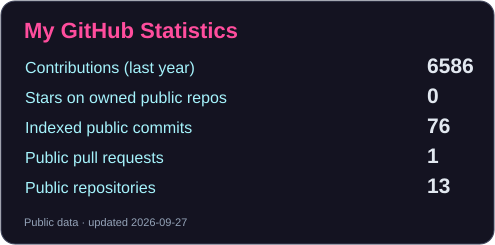
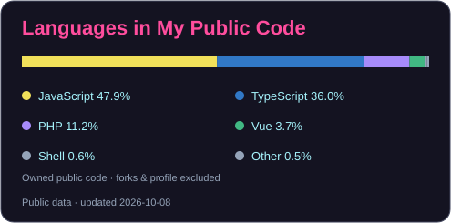

  

  
  
  
  

# Hi, I'm Farhad 👋

Backend engineer and technology leader based in Tehran.

[Portfolio](https://farhad-arjmand.github.io/farhad-arjmand/) · [LinkedIn](https://www.linkedin.com/in/farhadarjmand/) · [GitLab](https://gitlab.com/farhadarjmand) · [Email](mailto:farhadarjmand@gmail.com) · Tehran, Iran

I build backend systems with Node.js, NestJS, PHP and Go. I've also worked as a CTO, CEO and team lead, and have been building software since 2006.

At Mirorim, I built the team from the start and took on CEO, CTO and team-lead responsibilities at different stages. The wider team grew to around 50 people across engineering, product and related functions. At MOM, I assembled the engineering team and worked on healthcare software as both a developer and CTO.

I still work on code and architecture. My work also includes hiring, reviewing code and helping backend, frontend and mobile teams plan and release software.

## 🛠 Tools I work with

  

  

For backend development, I mainly use JavaScript/TypeScript, Node.js, NestJS, PHP and Go. My database experience includes PostgreSQL, MySQL, MongoDB, Cassandra, Redis and Elasticsearch. I also work with AWS, Docker, Kubernetes and CI/CD.

I use LLMs, retrieval and vector search in software projects, and AI coding tools during development. Code review and testing remain part of that process.

Backend is my main specialty. I also work with React Native and Flutter and have familiarity with Vue, Nuxt and React.

## 🧩 Open-source packages

Small, focused packages with TypeScript declarations, executable examples and CI:

| Package | Problem it addresses | Install / reference |
| --- | --- | --- |
| [inflight-kit](https://github.com/farhad-arjmand/inflight-kit) | Duplicate concurrent API reads, with independent cancellation and deadlines | [npm](https://www.npmjs.com/package/inflight-kit) · [Integration](https://github.com/farhad-arjmand/inflight-kit/blob/main/docs/integration.md) |
| [env-precheck](https://github.com/farhad-arjmand/env-precheck) | Missing or invalid deployment configuration, without printing values | [npm](https://www.npmjs.com/package/env-precheck) · [Integration](https://github.com/farhad-arjmand/env-precheck/blob/main/docs/integration.md) |
| [perso-match](https://github.com/farhad-arjmand/perso-match) | Persian/Arabic search mismatches, original-text highlights and database collision review | [npm](https://www.npmjs.com/package/perso-match) · [فارسی](https://github.com/farhad-arjmand/perso-match/blob/main/README.fa.md) · [العربية](https://github.com/farhad-arjmand/perso-match/blob/main/README.ar.md) |

Each package documents where it fits, where it does not, and how to integrate it. Compact `llms.txt` references are included for coding tools that read project documentation.

### Experimental research packages

ESM packages for Node.js 22+, with explicit data contracts and synthetic tests. These are research tools; they do not generate trading recommendations.

| Package | Use it for | Install / reference |
| --- | --- | --- |
| [market-data-freshness](https://github.com/farhad-arjmand/market-data-freshness) | Detect candle gaps, stale reconciliation, calendar uncertainty and conflicting duplicates. | [npm](https://www.npmjs.com/package/@farhadarjmand/market-data-freshness) · [API](https://github.com/farhad-arjmand/market-data-freshness/blob/main/docs/API.md) |
| [forecast-calibration](https://github.com/farhad-arjmand/forecast-calibration) | Evaluate binary forecasts with Brier score, log loss, ROC AUC and reproducible block bootstrap intervals. | [npm](https://www.npmjs.com/package/@farhadarjmand/forecast-calibration) · [API](https://github.com/farhad-arjmand/forecast-calibration/blob/main/docs/API.md) |
| [causal-market-structure](https://github.com/farhad-arjmand/causal-market-structure) | Inspect confirmed swings and structure events with explicit availability times for historical replay. | [npm](https://www.npmjs.com/package/@farhadarjmand/causal-market-structure) · [API](https://github.com/farhad-arjmand/causal-market-structure/blob/main/docs/API.md) |

[Browse all packages by problem](https://farhad-arjmand.github.io/farhad-arjmand/#packages) · [npm profile](https://www.npmjs.com/~farhadarjmand)

## More public code

- [LinkedIn Profile Search](https://github.com/farhad-arjmand/cyberyan-test): a NestJS and Elasticsearch technical sample, with setup instructions and API examples.
- [Lumen Hash Generator](https://github.com/farhad-arjmand/lumen-hash-generator): a PHP 8.2+ library for secure token generation and hashed token verification, rewritten in version 2.

Most of my commercial work is in private repositories. These are a few public samples, not my full work history.

## 📊 Around GitHub

  
  

Language percentages describe public code, not proficiency. Forks and this profile repository are excluded. Contributions follow the public profile calendar; indexed commits and pull requests cover public repositories only.

  
  
  

These badges reflect public GitHub activity. Most of my commercial engineering work lives in private repositories.

## 🤝 Get in touch

I'm interested in CTO, engineering management, technical lead and senior backend work. I'm based in Tehran and open to local roles or remote teams that can work with someone in Iran, on a full-time or contract basis.

## 🐍 Contribution snake

<picture>
  <source media="(prefers-color-scheme: dark)" srcset="assets/github-snake-dark.svg" />
  <source media="(prefers-color-scheme: light)" srcset="assets/github-snake.svg" />
  
</picture>

Visuals refresh daily with GitHub Actions. Snake animation powered by <a href="https://github.com/Platane/snk">Platane/snk</a>.
